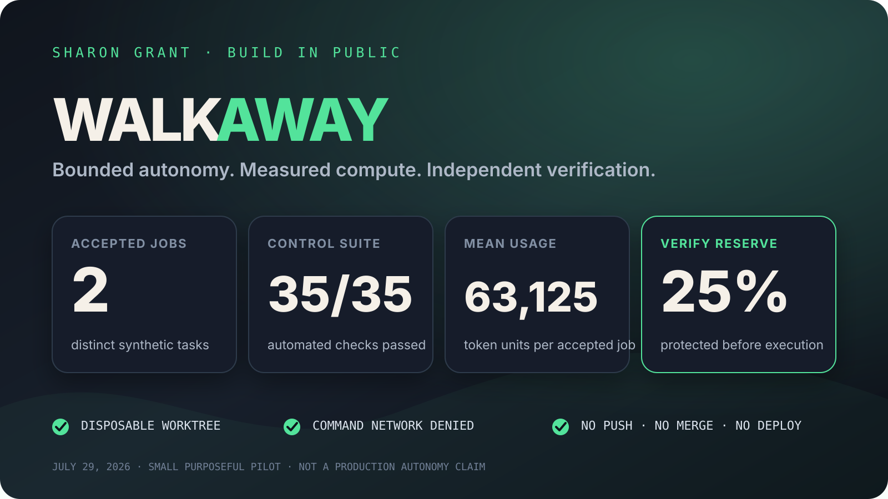
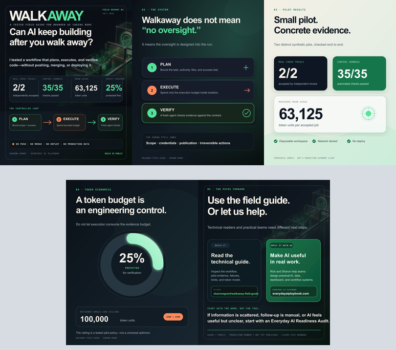

# Walkaway: a tested field guide for bounded AI coding runs

Walkaway is Sharon Grant's practical pattern for letting an AI coding agent
work unattended without confusing autonomy with unlimited authority.

The core idea is simple:

1. define and approve the outcome;
2. isolate one disposable worktree;
3. give the executor a narrow write boundary;
4. reserve a separate verification budget;
5. let tests and policy decide whether the result is acceptable; and
6. stop before merge, deployment, or publication.

This repository is a field guide and evidence report. It does **not** bundle
GSD Core, Ralph Orchestrator, Codex, or a production runner.

## What changed after testing

The first version of the guide described a plausible GSD + Ralph setup. The
July 29, 2026 pilot found several material corrections:

- pin versions for reproducibility;
- contain GSD's installer with a disposable `HOME`;
- use Ralph's current `event_loop` configuration keys;
- do not rely on an undocumented checkpoint interval;
- keep auto-merge disabled;
- do not use Ralph 2.10.1's built-in Codex backend;
- treat a completion phrase as a claim, not proof;
- enforce an outer timeout, exact-path diff policy, and secret scan;
- run a separate read-only verifier; and
- budget by phase while preserving a 25% verification reserve.

The revised [field guide](WALKAWAY-GUIDE.md) incorporates those findings.

## Verified pilot result

Two distinct, small synthetic Codex jobs completed in disposable Git
worktrees and passed independent verification:

| Job | Execution | Verification | Total |
| --- | ---: | ---: | ---: |
| Clamp function | 37,059 | 26,123 | 63,182 |
| Label normalization | 37,184 | 25,883 | 63,067 |

The mean was **63,125 token units**. The next-job calibration retained a
**100,000-unit whole-job ceiling**, with **25% protected for verification**.
The automated and adversarial suite passed **35 of 35** checks.

Read [RESULTS.md](RESULTS.md) for the evidence, scope, and limitations.

## Start here

- [Revised setup guide](WALKAWAY-GUIDE.md)
- [Pilot evidence and token calibration](RESULTS.md)
- [Safety model and non-goals](SAFETY.md)
- [Third-party notices](THIRD_PARTY_NOTICES.md)
- [LinkedIn launch draft](LINKEDIN-POST.md)

## LinkedIn launch kit

The launch kit contains five upload-ready 1080 × 1350 PNG slides, editable SVG
sources, and the text-free hero artwork. See the
[carousel upload order](assets/linkedin/README.md).

## Status

**Guide and aggregate evidence:** publicly released July 29, 2026  
**Reusable production runner:** not published  
**Automated GitHub PR broker:** not yet tested  
**AgentHub execution authority:** none

The next technical phase is a private throwaway-repository test of a
least-privilege draft-PR broker. Until that passes, Walkaway stops at a
locally verified patch.

## Attribution

Walkaway is a configuration, testing, and governance pattern by Sharon Grant.
It is independent and is not affiliated with or endorsed by Open GSD, Ralph
Orchestrator, OpenAI, Anthropic, or GitHub.
